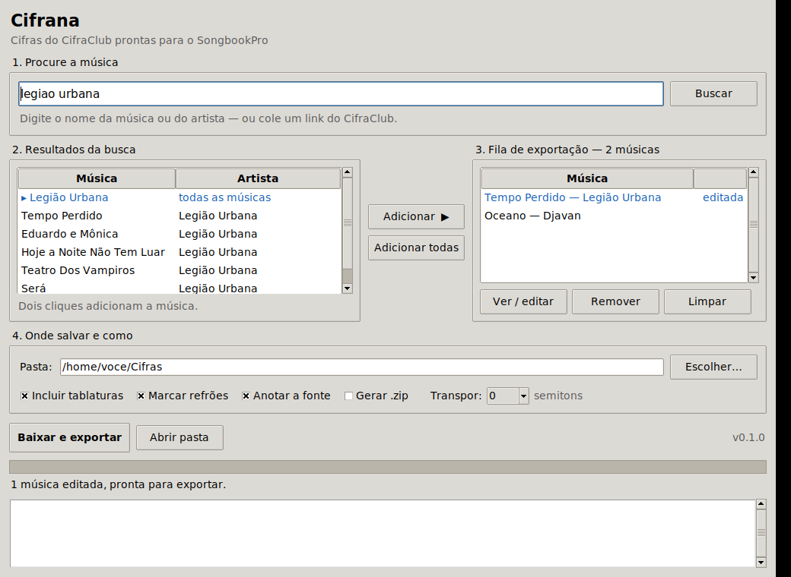
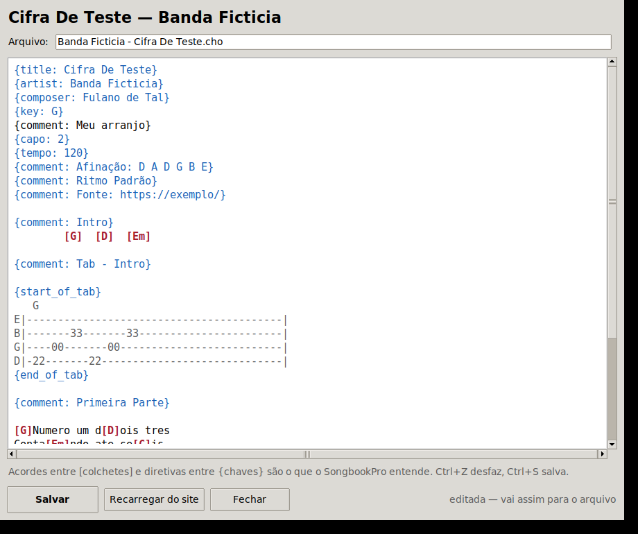

# Cifrana

Baixa cifras do **CifraClub** e exporta em **ChordPro** — o formato que o
**SongbookPro** importa nativamente.

Tem interface gráfica com busca integrada (você não precisa copiar link
nenhum) e também um comando de terminal, para quem quiser baixar em lote.



---

## Instalar no Linux Mint

### Jeito mais fácil: o pacote `.deb`

1. Baixe o `cifrana_*.deb` mais recente na
   [página de releases](https://github.com/ersou-tech/Cifrana/releases).
2. Clique duas vezes no arquivo — o **Instalador de Pacotes** do Mint abre e
   você só confirma.

Pelo terminal dá na mesma:

```bash
sudo apt install ./cifrana_0.1.0_all.deb
```

O `apt` puxa o `python3-tk` sozinho. Depois é só procurar por **Cifrana** no
menu iniciar. Para desinstalar: `sudo apt remove cifrana`.

> Se o `apt` responder **"Arquivo sem suporte ... fornecido na linha de
> comando"**, é porque o arquivo não está na pasta de onde você chamou o
> comando. Confira com `ls -l *.deb` antes — normalmente ele foi parar em
> `~/Downloads`.

### Atualizar pelo Gerenciador de Atualizações do Mint

Se você quer que o Cifrana seja atualizado junto com o resto do sistema, em vez
de baixar um `.deb` a cada versão, adicione o repositório APT:

```bash
echo "deb [trusted=yes] https://raw.githubusercontent.com/ersou-tech/Cifrana/apt/ ./" | sudo tee /etc/apt/sources.list.d/cifrana.list
sudo apt update
sudo apt install cifrana
```

Pronto. A partir daí toda versão nova aparece no **Gerenciador de
Atualizações**, junto com as atualizações do Mint.

O repositório vive no branch `apt`, publicado pelo workflow `repositorio-apt`
a cada release e servido por HTTPS pelo `raw.githubusercontent.com`. Não
depende do GitHub Pages estar ligado.

> O `[trusted=yes]` diz ao apt para aceitar os pacotes sem verificar
> assinatura. Para assinar o repositório e trocar isso por `signed-by`, rode
> `bash packaging/criar-chave-apt.sh` e guarde a chave no segredo
> `APT_GPG_KEY` do repositório — o script explica o passo a passo.

Para deixar de usar o repositório:

```bash
sudo rm /etc/apt/sources.list.d/cifrana.list
sudo apt update
```

### Direto do código, sem root

```bash
git clone https://github.com/ersou-tech/Cifrana.git
cd Cifrana
bash install.sh
```

Instala em `~/.local`, cria o atalho no menu e, se o Tkinter estiver faltando,
pergunta se pode instalar para você. Para remover: `bash install.sh --remover`.

Sem git, dá para baixar o ZIP pelo site (botão verde **Code** →
**Download ZIP**), extrair e rodar `bash install.sh` dentro da pasta.

> Use `bash install.sh`, e não `./install.sh` — arquivos vindos de um ZIP às
> vezes perdem a permissão de execução.

### Montando o `.deb` você mesmo

```bash
bash packaging/build-deb.sh          # gera dist/cifrana_0.1.0_all.deb
sudo apt install ./dist/cifrana_*.deb
```

### Outros sistemas

O código é Python puro, sem dependências além da biblioteca padrão, então
roda em qualquer lugar com Python 3.9+:

```bash
python3 -m cifrana --gui     # interface
python3 -m cifrana --help    # terminal
```

No Windows e no macOS o Tkinter já vem junto com o Python oficial.

---

## Usando a interface

1. **Procure** pelo nome da música ou do artista. Se preferir, cole um link do
   CifraClub direto na caixa de busca.
2. **Adicione** à fila — dois cliques em uma música, ou selecione várias.
   Clicando num resultado de artista (em azul) ele lista as músicas daquele
   artista.
3. **Confira e ajuste**, se quiser: selecione a música na fila e clique em
   **Ver / editar** (ou dê dois cliques nela).
4. **Escolha a pasta** e as opções: tablaturas, marcação de refrão, transposição
   em semitons e, se quiser, um `.zip` no fim.
5. **Baixar e exportar.** O progresso e os erros aparecem no registro embaixo.

As preferências ficam salvas em `~/.config/cifrana/config.json`, então na
próxima vez já abre do jeito que você deixou.

### O editor



O que você vê é exatamente o arquivo que o SongbookPro vai receber. O texto é
colorido para você se achar: **diretivas** entre chaves em azul, **acordes**
entre colchetes em vermelho, e o miolo das **tablaturas** em cinza.

Dá para corrigir um acorde errado, apagar uma tablatura que você não usa,
renomear o arquivo, acrescentar um `{comment: ...}` com uma anotação sua — o
que precisar. `Ctrl+Z` desfaz e `Ctrl+S` salva.

- **Salvar** guarda o texto para a exportação (ainda não grava em disco — isso
  acontece no *Baixar e exportar*).
- **Recarregar do site** joga fora suas mudanças e baixa a cifra de novo.

Uma música editada aparece marcada como **editada** na fila e é exportada
exatamente como está na tela. Isso significa que, se você mudar *Transpor* ou
as caixas de opção depois de editar, **essas opções não são reaplicadas** nela
— o seu texto tem a palavra final. Para voltar atrás, use *Recarregar do site*.

## Usando o terminal

```bash
# uma música
cifrana https://www.cifraclub.com.br/legiao-urbana/tempo-perdido/

# o atalho artista/musica também funciona
cifrana legiao-urbana/tempo-perdido -o ~/Cifras

# várias de uma vez, já empacotadas num zip
cifrana legiao-urbana/tempo-perdido djavan/oceano --zip cifras.zip

# tudo que aparece na página de um artista
cifrana --artista https://www.cifraclub.com.br/legiao-urbana/ -o ~/Cifras

# a partir de um arquivo com uma URL por linha
cifrana --lista minhas-musicas.txt -o ~/Cifras

# transpondo dois semitons acima
cifrana legiao-urbana/tempo-perdido --transpor 2

# só ver o resultado no terminal, sem gravar nada
cifrana legiao-urbana/tempo-perdido --stdout
```

Detalhes de todas as opções: `cifrana --help` ou `man cifrana`.

| Opção | O que faz |
| --- | --- |
| `-o, --saida PASTA` | pasta de saída (padrão `./cifras`) |
| `--zip ARQUIVO` | gera também um `.zip` com tudo |
| `--stdout` | imprime no terminal em vez de gravar |
| `--lista ARQUIVO` | lê URLs de um arquivo (`#` vira comentário) |
| `--artista URL` | pega as músicas da página do artista (pode repetir) |
| `--transpor N` | transpõe N semitons (ex.: `2`, `-3`) |
| `--refrao` | usa `{start_of_chorus}`/`{end_of_chorus}` nos refrões |
| `--sem-tabs` | descarta os blocos de tablatura |
| `--sem-fonte` | não inclui o comentário com a URL de origem |
| `--nome MODELO` | modelo do nome do arquivo: `{artist}`, `{title}`, `{key}` |
| `--ext .cho` | extensão dos arquivos gerados |
| `--ascii` | tira acentos dos nomes de arquivo |
| `--sobrescrever` | sobrescreve em vez de criar `(2)` |
| `--intervalo SEG` | pausa entre requisições (padrão `1.0`) |
| `--cache PASTA` / `--sem-cache` / `--recarregar` | controle do cache de HTML |
| `--gui` | abre a interface gráfica |

---

## Levando para o SongbookPro

1. Exporte com a opção **Gerar .zip** marcada (ou pegue a pasta com os `.cho`).
2. Passe os arquivos para o celular ou tablet — Google Drive, Dropbox, e-mail,
   cabo, o que for mais fácil.
3. No SongbookPro: **Menu → Import**, escolha importar arquivos ou pasta e
   selecione os `.cho` (ou o zip).
4. O SongbookPro lê `{title}`, `{artist}`, `{key}`, `{capo}` e `{tempo}` e já
   preenche os campos da música — a transposição e o capotraste continuam
   funcionando dentro do app.

Se o seu SongbookPro estiver configurado para outra extensão, use
`--ext .chopro` ou `--ext .pro` no terminal.

## Exemplo de saída

```chordpro
{title: Cifra De Teste}
{artist: Banda Ficticia}
{key: G}
{capo: 2}
{tempo: 120}

{comment: Intro}
[G]  [D]  [Em]

{comment: Primeira Parte}
[G]Numero um d[D]ois tres
     [Em]Contando [C]ate seis
```

## Como funciona

O CifraClub escreve os acordes numa linha **acima** da letra; o SongbookPro os
espera **dentro** da linha, entre colchetes. Como o bloco da cifra é
monoespaçado, dá para guardar a coluna de cada acorde e inseri-lo exatamente
na sílaba certa.

1. `urls.py` normaliza qualquer URL do CifraClub para
   `.../artista/musica/imprimir.html` — a versão de impressão entrega a cifra
   em HTML puro, sem depender de JavaScript.
2. `search.py` consulta o mesmo endpoint de busca que a caixa de pesquisa do
   site usa.
3. `parser.py` lê os blocos `<pre>` (um por página A4) guardando, para cada
   acorde, o nome e a **coluna**, além dos metadados do cabeçalho.
4. `chordpro.py` classifica cada linha (seção, acordes, letra, tablatura,
   vazia), casa cada linha de acordes com a letra logo abaixo e insere os
   `[acordes]` nas colunas certas.
5. `exporter.py` grava os `.cho` com nome seguro e, se você pedir, monta o zip.
6. `gui.py` é a interface; toda a rede roda em thread separada, para a janela
   nunca travar.

## Desenvolvimento

```bash
make test         # roda os testes
make gui          # abre a interface a partir do código
make deb          # monta o pacote em dist/
make instalar     # instala em ~/.local
make limpar
```

Os testes usam um fixture sintético (música inventada), sem conteúdo de
terceiros.

## Aviso

As cifras do CifraClub são de seus autores e editoras. Use esta ferramenta
apenas para uso pessoal, para levar ao seu próprio songbook o que você já tem
direito de acessar, e respeite os termos de uso do site. A pausa entre
requisições existe justamente para não sobrecarregar o servidor — não baixe
catálogos inteiros nem redistribua o resultado.

## Licença

MIT — veja [LICENSE](LICENSE).
